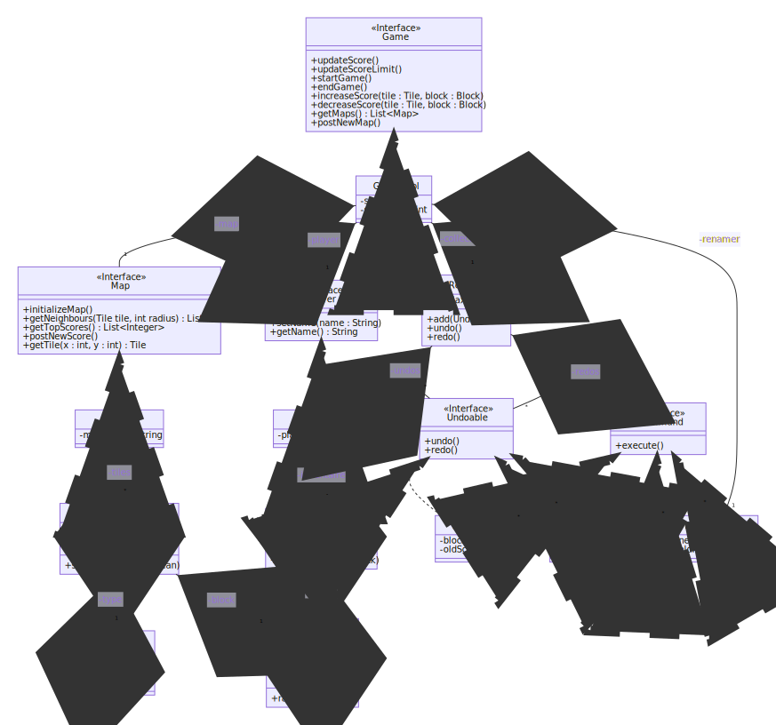
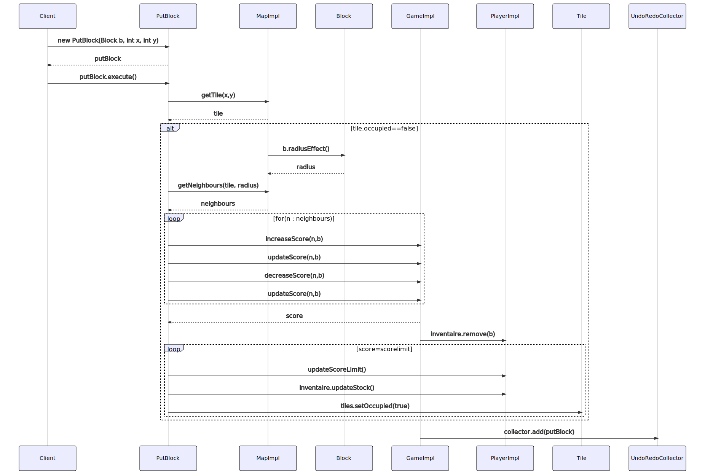
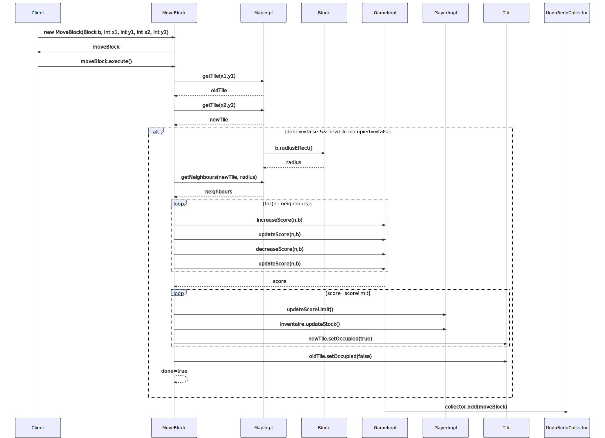
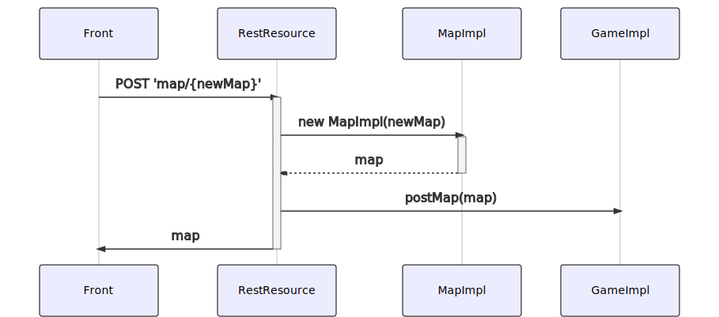
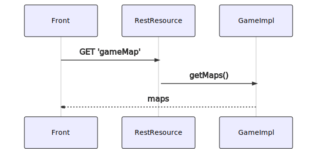
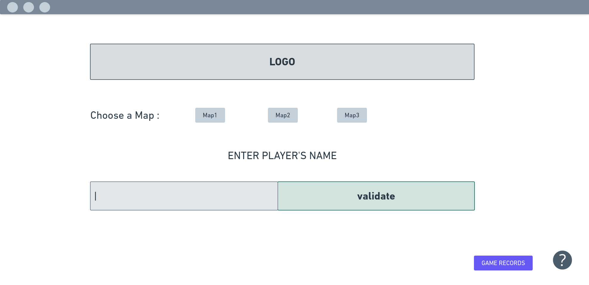
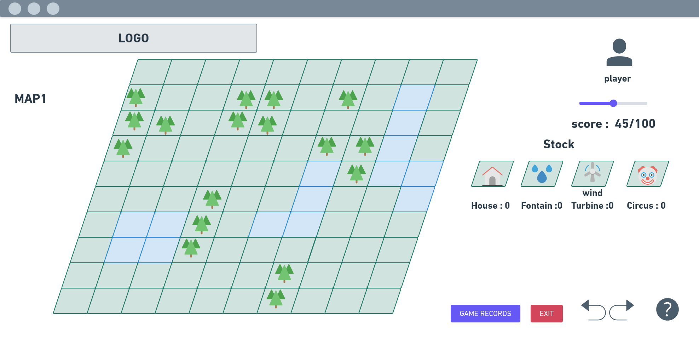
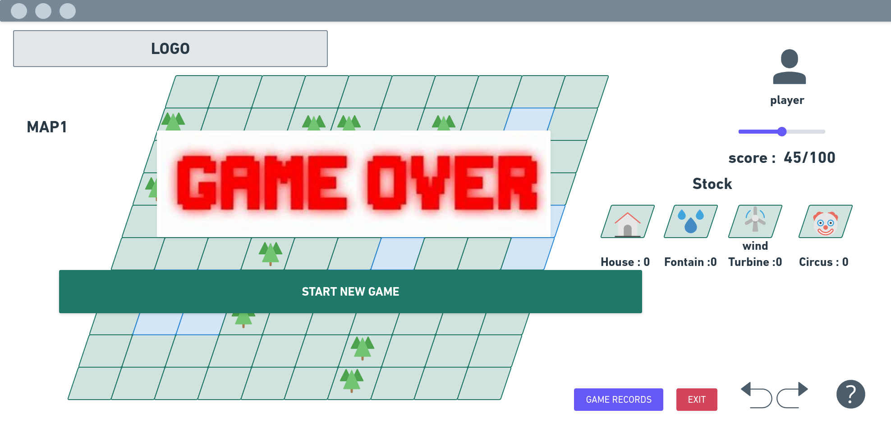
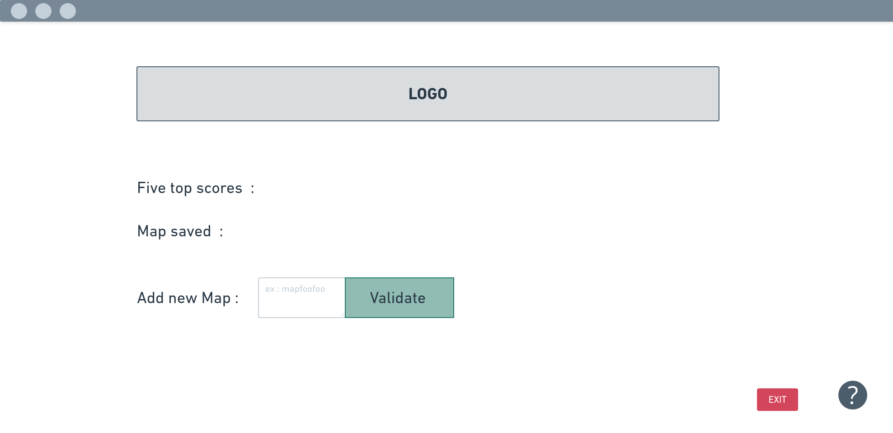
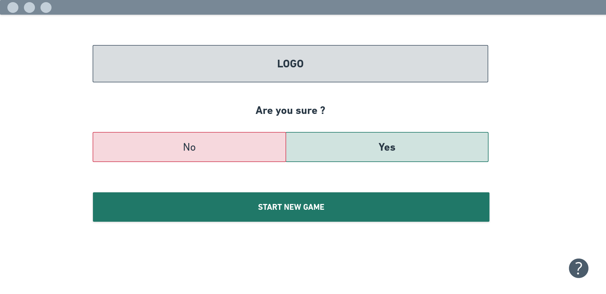

# Modelling Report

Romain HU 

Dakini MALLAM GARBA

# Diagramme de classes

Pour la classe MoveBlock, le block à déplacer est dans le paramètre du constructeur

# Routes REST

**[REST_MAP]**

verbe : GET

URI : /map

 exemple de sortie Json:

{

"mapList" : ["map1","map2","map3"]

}

**[REST_GET_SCORE]**

verbe : GET

URI : /score/{map}/

exemple de sortie Json : 

{
	"mapName" : "map",

​	"scoreList" : [5,4,3,2,1]

}

**[REST_ADD_SCORE]**

verb : POST

URI : /score/{map}/{player}/{newScore}

exemple de sortie Json :

{ "mapName" : "map",

  "playerName" : "player",

  "Score" : newScore

}

# Diagrammes de séquences

### Ajouter un nouveau bloc sur la Map

### Déplacer un bloc

# Diagrammes de séquence REST

### Ajout d'une nouvelle Map

### Retourner la liste des Maps du jeu

# Mock-up

### Page d'accueil

### Page du jeu

### Partie terminée

### Page des scores

### Quitter le jeu

